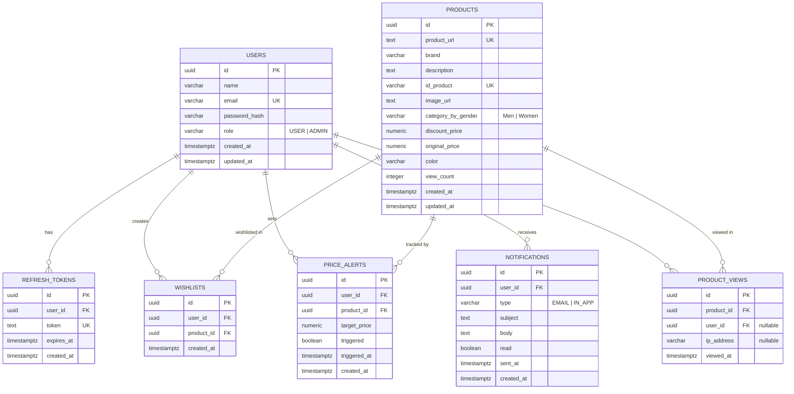

# ER Diagram — GenZ Fashion Hub

## Database: PostgreSQL

All tables use UUID primary keys. Timestamps use `TIMESTAMPTZ`.

---

## ER Diagram (Mermaid)



---

## Table Descriptions

### `users`
Stores registered user accounts.

| Column | Type | Notes |
|---|---|---|
| `id` | UUID | Primary key |
| `name` | VARCHAR(100) | Display name |
| `email` | VARCHAR(255) | Unique, used for login |
| `password_hash` | VARCHAR(255) | bcrypt hash |
| `role` | VARCHAR(10) | `USER` or `ADMIN` |
| `created_at` | TIMESTAMPTZ | Auto-set |
| `updated_at` | TIMESTAMPTZ | Auto-updated |

---

### `refresh_tokens`
Stores JWT refresh tokens for session management.

| Column | Type | Notes |
|---|---|---|
| `id` | UUID | Primary key |
| `user_id` | UUID | FK → `users.id` (CASCADE DELETE) |
| `token` | TEXT | Unique, hashed token |
| `expires_at` | TIMESTAMPTZ | Token expiry |
| `created_at` | TIMESTAMPTZ | Auto-set |

---

### `products`
Core product catalog imported from `genz.csv`.

| Column | Type | Notes |
|---|---|---|
| `id` | UUID | Primary key |
| `product_url` | TEXT | Unique AJIO product URL |
| `brand` | VARCHAR(100) | e.g. `levis`, `netplay` |
| `description` | TEXT | Product name/description |
| `id_product` | VARCHAR(50) | Unique AJIO product ID |
| `image_url` | TEXT | CDN image URL |
| `category_by_gender` | VARCHAR(10) | `Men` or `Women` |
| `discount_price` | NUMERIC(10,2) | Current selling price (₹) |
| `original_price` | NUMERIC(10,2) | MRP (₹) |
| `color` | VARCHAR(50) | e.g. `blue`, `navy`, `white` |
| `view_count` | INTEGER | Default 0 |
| `created_at` | TIMESTAMPTZ | Auto-set |
| `updated_at` | TIMESTAMPTZ | Auto-updated |

**Indexes**:
- `idx_products_brand` on `brand`
- `idx_products_color` on `color`
- `idx_products_gender` on `category_by_gender`
- `idx_products_discount_price` on `discount_price`
- Full-text index on `(brand || ' ' || description)` for search

---

### `wishlists`
Junction table linking users to their saved products.

| Column | Type | Notes |
|---|---|---|
| `id` | UUID | Primary key |
| `user_id` | UUID | FK → `users.id` (CASCADE DELETE) |
| `product_id` | UUID | FK → `products.id` (CASCADE DELETE) |
| `created_at` | TIMESTAMPTZ | When wishlisted |

**Constraints**:
- `UNIQUE(user_id, product_id)` — prevents duplicate wishlist entries

---

### `price_alerts`
Stores user-defined price drop alerts for products.

| Column | Type | Notes |
|---|---|---|
| `id` | UUID | Primary key |
| `user_id` | UUID | FK → `users.id` (CASCADE DELETE) |
| `product_id` | UUID | FK → `products.id` (CASCADE DELETE) |
| `target_price` | NUMERIC(10,2) | Alert triggers when `discount_price ≤ target_price` |
| `triggered` | BOOLEAN | Default `false` |
| `triggered_at` | TIMESTAMPTZ | Nullable, set when triggered |
| `created_at` | TIMESTAMPTZ | Auto-set |

**Indexes**:
- `idx_alerts_pending` on `(triggered)` WHERE `triggered = false`

---

### `notifications`
Audit log of all notifications sent to users.

| Column | Type | Notes |
|---|---|---|
| `id` | UUID | Primary key |
| `user_id` | UUID | FK → `users.id` (CASCADE DELETE) |
| `type` | VARCHAR(10) | `EMAIL` or `IN_APP` |
| `subject` | TEXT | Notification subject |
| `body` | TEXT | Notification body |
| `read` | BOOLEAN | Default `false` (for in-app) |
| `sent_at` | TIMESTAMPTZ | When dispatched |
| `created_at` | TIMESTAMPTZ | Auto-set |

---

### `product_views`
Tracks product view events for trending calculation.

| Column | Type | Notes |
|---|---|---|
| `id` | UUID | Primary key |
| `product_id` | UUID | FK → `products.id` (CASCADE DELETE) |
| `user_id` | UUID | Nullable FK → `users.id` (guest views allowed) |
| `ip_address` | VARCHAR(45) | Nullable, for guest tracking |
| `viewed_at` | TIMESTAMPTZ | Auto-set |

**Indexes**:
- `idx_views_product_id` on `product_id`
- `idx_views_viewed_at` on `viewed_at` (for time-windowed trending queries)

---

## Relationships Summary

| Relationship | Type | Description |
|---|---|---|
| `users` → `refresh_tokens` | 1:N | One user has many refresh tokens |
| `users` → `wishlists` | 1:N | One user has many wishlist entries |
| `users` → `price_alerts` | 1:N | One user has many price alerts |
| `users` → `notifications` | 1:N | One user receives many notifications |
| `users` → `product_views` | 1:N | One user generates many views (nullable) |
| `products` → `wishlists` | 1:N | One product can be in many wishlists |
| `products` → `price_alerts` | 1:N | One product can have many alerts |
| `products` → `product_views` | 1:N | One product has many view events |

---

## Key Constraints

```sql
-- Prevent duplicate wishlist entries
ALTER TABLE wishlists ADD CONSTRAINT uq_wishlist_user_product UNIQUE (user_id, product_id);

-- Prevent duplicate product IDs from CSV
ALTER TABLE products ADD CONSTRAINT uq_product_id_product UNIQUE (id_product);

-- Cascade deletes: removing a user cleans up all their data
ALTER TABLE wishlists ADD CONSTRAINT fk_wishlist_user FOREIGN KEY (user_id) REFERENCES users(id) ON DELETE CASCADE;
ALTER TABLE price_alerts ADD CONSTRAINT fk_alert_user FOREIGN KEY (user_id) REFERENCES users(id) ON DELETE CASCADE;
```
