# Class Diagram — GenZ Fashion Hub

## Architecture Overview

The backend follows a **Layered Architecture** with clear separation of concerns:

```
Routes → Controllers → Services → Repositories → Database
```

OOP principles applied:
- **Encapsulation**: Each class owns its data and exposes only what's needed
- **Abstraction**: Base classes and interfaces hide implementation details
- **Inheritance**: Concrete repositories extend `BaseRepository<T>`
- **Polymorphism**: `NotificationService` dispatches to different `INotifier` implementations

---

## Class Diagram (Mermaid)

```mermaid
classDiagram

    %% ─────────────────────────────────────────
    %% DOMAIN MODELS
    %% ─────────────────────────────────────────

    class User {
        +id: string
        +name: string
        +email: string
        +passwordHash: string
        +role: UserRole
        +createdAt: Date
        +toSafeObject() SafeUser
    }

    class Product {
        +id: string
        +productUrl: string
        +brand: string
        +description: string
        +idProduct: string
        +imageUrl: string
        +categoryByGender: GenderCategory
        +discountPrice: number
        +originalPrice: number
        +color: string
        +viewCount: number
        +createdAt: Date
        +getDiscountPercentage() number
    }

    class WishlistItem {
        +id: string
        +userId: string
        +productId: string
        +createdAt: Date
    }

    class PriceAlert {
        +id: string
        +userId: string
        +productId: string
        +targetPrice: number
        +triggered: boolean
        +triggeredAt: Date
        +createdAt: Date
        +isTriggered(currentPrice: number) boolean
    }

    class RefreshToken {
        +id: string
        +userId: string
        +token: string
        +expiresAt: Date
        +isExpired() boolean
    }

    %% ─────────────────────────────────────────
    %% ENUMS
    %% ─────────────────────────────────────────

    class UserRole {
        <<enumeration>>
        USER
        ADMIN
    }

    class GenderCategory {
        <<enumeration>>
        Men
        Women
    }

    User --> UserRole
    Product --> GenderCategory

    %% ─────────────────────────────────────────
    %% REPOSITORY LAYER (Repository Pattern)
    %% ─────────────────────────────────────────

    class IRepository~T~ {
        <<interface>>
        +findById(id: string) T
        +findAll(filters: object) T[]
        +create(data: Partial~T~) T
        +update(id: string, data: Partial~T~) T
        +delete(id: string) void
    }

    class BaseRepository~T~ {
        #prisma: PrismaClient
        +findById(id: string) T
        +findAll(filters: object) T[]
        +create(data: Partial~T~) T
        +update(id: string, data: Partial~T~) T
        +delete(id: string) void
    }

    class UserRepository {
        +findByEmail(email: string) User
        +findById(id: string) User
        +create(data: CreateUserDto) User
    }

    class ProductRepository {
        +findAll(filters: ProductFilters, pagination: Pagination) ProductPage
        +findById(id: string) Product
        +search(query: string) Product[]
        +incrementViewCount(id: string) void
        +upsertMany(products: Partial~Product~[]) number
        +findTrending(limit: number) Product[]
    }

    class WishlistRepository {
        +findByUser(userId: string) WishlistItem[]
        +findByUserAndProduct(userId: string, productId: string) WishlistItem
        +create(userId: string, productId: string) WishlistItem
        +delete(id: string) void
    }

    class AlertRepository {
        +findByUser(userId: string) PriceAlert[]
        +findPendingAlerts() PriceAlert[]
        +create(data: CreateAlertDto) PriceAlert
        +markAsTriggered(id: string) void
    }

    IRepository~T~ <|.. BaseRepository~T~
    BaseRepository~T~ <|-- UserRepository
    BaseRepository~T~ <|-- ProductRepository
    BaseRepository~T~ <|-- WishlistRepository
    BaseRepository~T~ <|-- AlertRepository

    UserRepository --> User
    ProductRepository --> Product
    WishlistRepository --> WishlistItem
    AlertRepository --> PriceAlert

    %% ─────────────────────────────────────────
    %% SERVICE LAYER
    %% ─────────────────────────────────────────

    class AuthService {
        -userRepo: UserRepository
        -jwtSecret: string
        +register(dto: RegisterDto) AuthTokens
        +login(dto: LoginDto) AuthTokens
        +refreshToken(token: string) AuthTokens
        +logout(userId: string) void
        -hashPassword(password: string) string
        -verifyPassword(plain: string, hash: string) boolean
        -generateTokens(userId: string) AuthTokens
    }

    class ProductService {
        -productRepo: ProductRepository
        -redis: RedisClient
        +getProducts(filters: ProductFilters, pagination: Pagination) ProductPage
        +getProductById(id: string) Product
        +searchProducts(query: string) Product[]
        +getTrending() Product[]
        +getRecommendations(productId: string) Product[]
        -buildCacheKey(filters: object) string
    }

    class WishlistService {
        -wishlistRepo: WishlistRepository
        -productRepo: ProductRepository
        +getWishlist(userId: string) WishlistItem[]
        +addToWishlist(userId: string, productId: string) WishlistItem
        +removeFromWishlist(userId: string, itemId: string) void
    }

    class AlertService {
        -alertRepo: AlertRepository
        -notificationSvc: NotificationService
        +createAlert(userId: string, productId: string, targetPrice: number) PriceAlert
        +getUserAlerts(userId: string) PriceAlert[]
        +deleteAlert(userId: string, alertId: string) void
        +processPendingAlerts() void
    }

    class ImportService {
        -productRepo: ProductRepository
        +importFromCSV(filePath: string) ImportResult
        -parseCSV(filePath: string) RawProduct[]
        -transformRow(row: RawProduct) Partial~Product~
        -batchUpsert(products: Partial~Product~[], batchSize: number) void
    }

    AuthService --> UserRepository
    ProductService --> ProductRepository
    WishlistService --> WishlistRepository
    WishlistService --> ProductRepository
    AlertService --> AlertRepository
    ImportService --> ProductRepository

    %% ─────────────────────────────────────────
    %% NOTIFICATION (Factory + Strategy Pattern)
    %% ─────────────────────────────────────────

    class INotifier {
        <<interface>>
        +send(to: string, subject: string, body: string) void
    }

    class EmailNotifier {
        -transporter: Nodemailer
        +send(to: string, subject: string, body: string) void
    }

    class InAppNotifier {
        -redis: RedisClient
        +send(to: string, subject: string, body: string) void
    }

    class NotificationService {
        -notifiers: INotifier[]
        +notify(userId: string, message: NotificationMessage) void
        +addNotifier(notifier: INotifier) void
    }

    class NotifierFactory {
        +create(type: NotifierType) INotifier
    }

    INotifier <|.. EmailNotifier
    INotifier <|.. InAppNotifier
    NotificationService --> INotifier
    NotifierFactory --> INotifier
    AlertService --> NotificationService

    %% ─────────────────────────────────────────
    %% CONTROLLER LAYER
    %% ─────────────────────────────────────────

    class AuthController {
        -authSvc: AuthService
        +register(req, res) void
        +login(req, res) void
        +refreshToken(req, res) void
        +logout(req, res) void
    }

    class ProductController {
        -productSvc: ProductService
        +getProducts(req, res) void
        +getProductById(req, res) void
        +searchProducts(req, res) void
        +getTrending(req, res) void
    }

    class WishlistController {
        -wishlistSvc: WishlistService
        +getWishlist(req, res) void
        +addToWishlist(req, res) void
        +removeFromWishlist(req, res) void
    }

    class AlertController {
        -alertSvc: AlertService
        +createAlert(req, res) void
        +getUserAlerts(req, res) void
        +deleteAlert(req, res) void
    }

    class AdminController {
        -importSvc: ImportService
        -productSvc: ProductService
        +importCSV(req, res) void
        +getAnalytics(req, res) void
        +manageProducts(req, res) void
    }

    AuthController --> AuthService
    ProductController --> ProductService
    WishlistController --> WishlistService
    AlertController --> AlertService
    AdminController --> ImportService
    AdminController --> ProductService

    %% ─────────────────────────────────────────
    %% INFRASTRUCTURE (Singleton Pattern)
    %% ─────────────────────────────────────────

    class DatabaseClient {
        -static instance: DatabaseClient
        -prisma: PrismaClient
        +static getInstance() DatabaseClient
        +getClient() PrismaClient
    }

    class RedisClient {
        -static instance: RedisClient
        -client: IORedis
        +static getInstance() RedisClient
        +get(key: string) string
        +set(key: string, value: string, ttl: number) void
        +del(key: string) void
    }

    BaseRepository~T~ --> DatabaseClient
    ProductService --> RedisClient
    InAppNotifier --> RedisClient
```



---

## Design Patterns Summary

| Pattern | Where Used | Why |
|---|---|---|
| **Repository** | `BaseRepository<T>` + concrete repos | Decouples data access from business logic |
| **Singleton** | `DatabaseClient`, `RedisClient` | Single shared connection pool |
| **Factory** | `NotifierFactory` | Creates correct notifier without coupling |
| **Strategy** | `INotifier` implementations | Swap email/in-app notification without changing `AlertService` |
| **Observer** | `PriceAlert` + `AlertService` | User "subscribes" to price events |
| **Template Method** | `BaseRepository<T>` | Common CRUD logic, subclasses override specifics |
