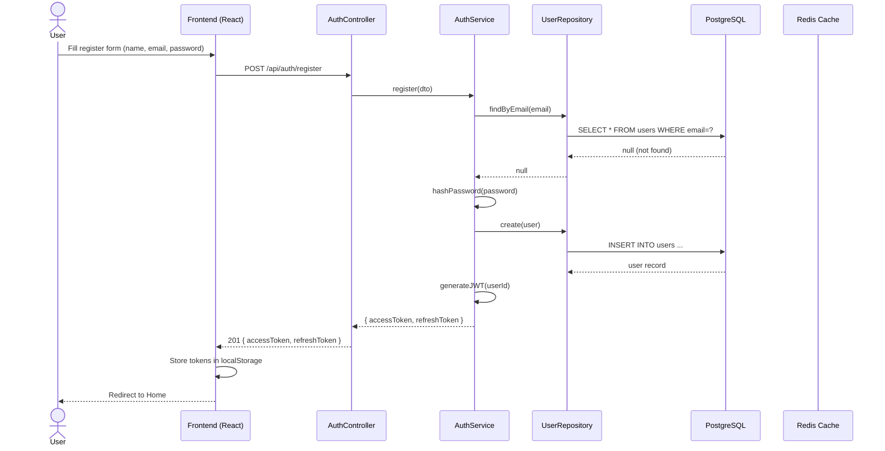
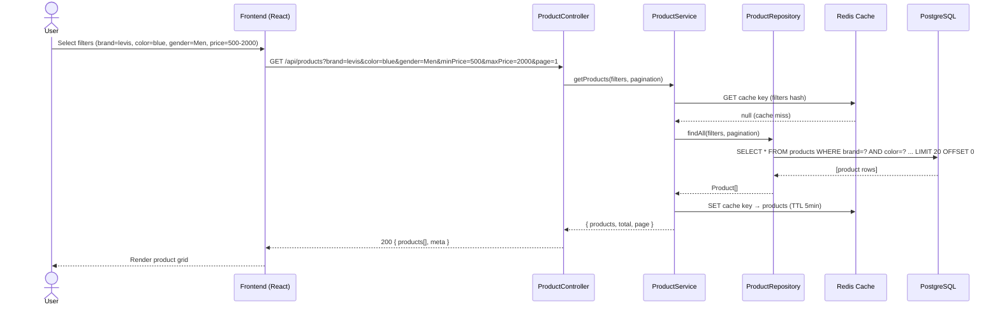
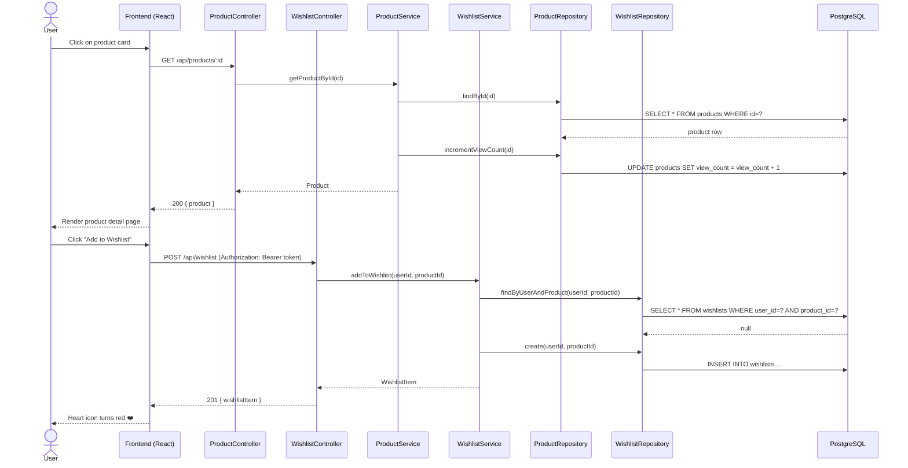
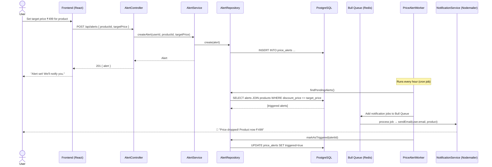
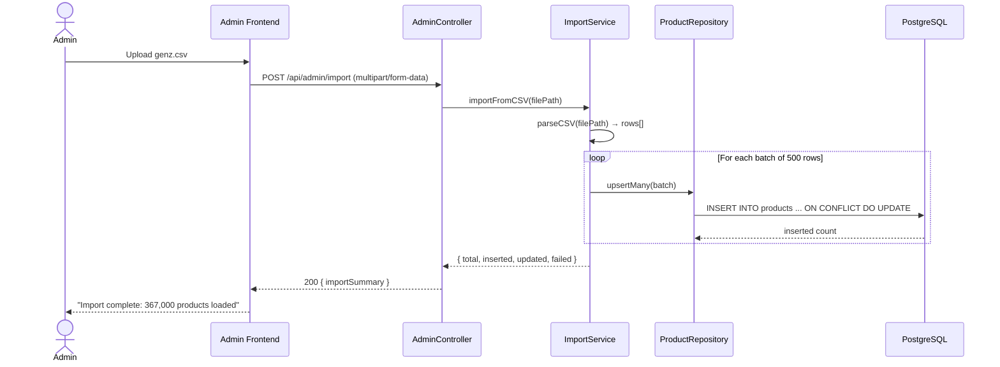

# Sequence Diagram — GenZ Fashion Hub (Main Flow End-to-End)

## Flow 1: User Registration & Login

---

## Flow 2: Browse & Filter Products

---

## Flow 3: View Product Detail & Add to Wishlist

---

## Flow 4: Set Price Alert & Background Notification

---

## Flow 5: Admin CSV Import

