# Use Case Diagram — GenZ Fashion Hub

## Actors

| Actor | Description |
|---|---|
| **Guest** | Unauthenticated visitor |
| **User** | Registered & logged-in shopper |
| **Admin** | Platform administrator |
| **System** | Automated background services |

---

## Use Case Diagram (Mermaid)

```mermaid
flowchart TD
    Guest([👤 Guest])
    User([🛍️ User])
    Admin([🛠️ Admin])
    System([⚙️ System])

    subgraph Public["🌐 Public Access"]
        UC1[Browse Products]
        UC2[Search Products]
        UC3[Filter by Brand / Color / Category / Price]
        UC4[View Product Details]
        UC5[Register Account]
        UC6[Login]
    end

    subgraph Authenticated["🔐 Authenticated User"]
        UC7[Add to Wishlist]
        UC8[Remove from Wishlist]
        UC9[View Wishlist]
        UC10[Set Price Alert]
        UC11[View Recommendations]
        UC12[View Trending Products]
        UC13[Update Profile]
        UC14[Logout]
        UC15[Share Wishlist]
    end

    subgraph AdminPanel["🛠️ Admin Panel"]
        UC16[Manage Products - CRUD]
        UC17[Manage Users]
        UC18[View Analytics Dashboard]
        UC19[Import Products from CSV]
        UC20[View Price Alert Logs]
    end

    subgraph SystemJobs["⚙️ System / Background Jobs"]
        UC21[Send Price Drop Email Notification]
        UC22[Update Trending Products Cache]
        UC23[Generate Recommendations]
    end

    Guest --> UC1
    Guest --> UC2
    Guest --> UC3
    Guest --> UC4
    Guest --> UC5
    Guest --> UC6

    User --> UC1
    User --> UC2
    User --> UC3
    User --> UC4
    User --> UC7
    User --> UC8
    User --> UC9
    User --> UC10
    User --> UC11
    User --> UC12
    User --> UC13
    User --> UC14
    User --> UC15

    Admin --> UC16
    Admin --> UC17
    Admin --> UC18
    Admin --> UC19
    Admin --> UC20

    System --> UC21
    System --> UC22
    System --> UC23

    UC10 -.->|triggers| UC21
    UC7 -.->|feeds| UC22
    UC4 -.->|feeds| UC23
```

---

## Use Case Descriptions

### UC1 — Browse Products
- **Actor**: Guest, User
- **Description**: Paginated product listing with lazy-loaded images
- **Precondition**: None
- **Postcondition**: Products displayed with discount price, brand, color

### UC2 — Search Products
- **Actor**: Guest, User
- **Description**: Full-text search on product description and brand name
- **Precondition**: None
- **Postcondition**: Matching products returned, ranked by relevance

### UC3 — Filter Products
- **Actor**: Guest, User
- **Description**: Multi-filter by brand, color, gender category, price range
- **Precondition**: None
- **Postcondition**: Filtered product list returned

### UC4 — View Product Details
- **Actor**: Guest, User
- **Description**: View full product info: image, brand, description, original price, discount price, color, product URL
- **Precondition**: None
- **Postcondition**: Product detail page rendered; view count incremented

### UC5 — Register Account
- **Actor**: Guest
- **Description**: Create account with name, email, password
- **Precondition**: Email not already registered
- **Postcondition**: Account created, JWT issued

### UC6 — Login
- **Actor**: Guest
- **Description**: Authenticate with email + password
- **Precondition**: Account exists
- **Postcondition**: JWT access token + refresh token issued

### UC7 — Add to Wishlist
- **Actor**: User
- **Description**: Save a product to personal wishlist
- **Precondition**: User authenticated, product exists
- **Postcondition**: Product added to wishlist; wishlist count updated

### UC8 — Remove from Wishlist
- **Actor**: User
- **Description**: Remove a product from wishlist
- **Precondition**: Product in wishlist
- **Postcondition**: Product removed

### UC9 — View Wishlist
- **Actor**: User
- **Description**: View all wishlisted products with current prices
- **Precondition**: User authenticated
- **Postcondition**: Wishlist displayed with live price data

### UC10 — Set Price Alert
- **Actor**: User
- **Description**: Set a target price for a product; get notified when price drops to or below it
- **Precondition**: User authenticated, product exists
- **Postcondition**: Alert stored; background job monitors it

### UC11 — View Recommendations
- **Actor**: User
- **Description**: View products similar to recently viewed/wishlisted items
- **Precondition**: User has browsing/wishlist history
- **Postcondition**: Recommended products displayed

### UC12 — View Trending Products
- **Actor**: User
- **Description**: View most wishlisted and most viewed products
- **Precondition**: None
- **Postcondition**: Trending list displayed (served from Redis cache)

### UC16 — Manage Products (CRUD)
- **Actor**: Admin
- **Description**: Create, read, update, delete product entries
- **Precondition**: Admin authenticated
- **Postcondition**: Product catalog updated

### UC19 — Import Products from CSV
- **Actor**: Admin
- **Description**: Upload `genz.csv` to bulk-import products into database
- **Precondition**: Admin authenticated
- **Postcondition**: Products parsed and inserted/updated in DB

### UC21 — Send Price Drop Notification
- **Actor**: System
- **Description**: Background job checks price alerts; sends email if target price met
- **Precondition**: Alert exists, price has dropped
- **Postcondition**: Email sent, alert marked as triggered
